# 2008-08-28

## [Big rally on Wall Street](https://money.cnn.com/2008/08/28/markets/markets_newyork/index.htm)
### A surprisingly strong revision to second-quarter economic growth gives stocks a boost. Oil prices turn lower as worries about a possible Gustav disruption ease.

> NEW YORK (CNNMoney.com) -- Stocks jumped Thursday, with the Dow and S&P 500 rising for the third straight session thanks to lower oil prices, a surprisingly strong reading on second-quarter economic growth, and a rally in the financial sector.

> Stocks gained modestly in the morning, and the GDP report was countered by a spike in oil prices, as Tropical Storm Gustav careened toward the Gulf Coast. But, by late morning, oil prices fell as traders bet the government would release supplies from the Strategic Petroleum Reserve. Oil also declined after a report showed a jump in natural gas supplies last week.

> Selkin noted that Fannie Mae and Freddie Mac have risen for six sessions in a row, as fears that they are set to be taken over by the government seem to have dwindled. "The fact that the big guys are doing better is positive for the whole group," he said.

> But for the overall stock market to keep climbing beyond today, the financials have to keep rising, Selkin said.

> **GDP**: Gross domestic product, the broadest measure of the economy, increased by a 3.3% annualized rate in the second quarter, the government reported. The revised reading improved on the initial report of 1.9% that was issued late last month, and topped expectations for a growth rate of 2.7%. 

> It was the best reading since the third quarter of 2007, and showed a marked improvement from the sluggish 0.9% pace in the first quarter. However, the growth was largely due to a spike in exports as a result of the weak dollar - and the more than $90 billion in economic stimulus checks that reached taxpayers during the quarter

> "It was a bit of a relief that we saw such good trade numbers in the quarter that kept GDP growth on a positive slant, but it doesn't change anything," said Scott Anderson, a senior economist at Wells Fargo.

> He explained that as global growth wanes and the dollar continues to firm up, exports will slow and the "trade effect" will dissipate. Subsequently, he expects slowing growth and flat demand through the second half of the year.

> In other economic news, a separate government report showed that the number of Americans filing new claims for unemployment fell for the third week in a row, meeting expectations.

TODO: add unemployment claims

> Other markets: In the bond market, Treasury prices slipped, raising the yield on the benchmark 10-year note to 3.78% from 3.76% late Wednesday. Prices and yields move in opposite directions.

> The dollar gained, versus the euro and the yen.

TODO: add dollar chart

# 2008-09-04

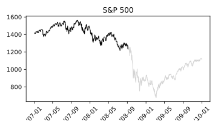

## [Brutal selloff on Wall Street](https://money.cnn.com/2008/09/04/markets/markets_newyork/index.htm)
### Dow loses 345 points as mixed retail sales reports, weak job market news and an oil price slide magnify fears about a global slowdown.

> NEW YORK (CNNMoney.com) -- Stocks plummeted Thursday, with the Dow plunging around 345 points as mixed retail sales, lower oil prices and dour labor market readings amplified worries about a global economic slowdown.

> Friday's focus will be the August employment report from the government. But economists don't expect a job market turnaround anytime soon.

TODO: add unemployment stats

> "The market is looking out and trying to discount six months from now, but all the same issues are still there," he said. "And now there's more of a realization that global growth has slowed. That's become a front-burner issue." 

> "I think the economy is really weak and this bear market is a correct reflection of that," said Len Blum, managing director at Westwood Capital.

> He said that whether it meets the technical definition of a recession or not, the current environment feels like a recession and it's being led by the consumer. 

> "Consumers are getting hit on a lot of fronts," he said. "They're getting crushed at the grocery store and the gas pump, they can't borrow and the labor market is weak."

> Adding to the gloom and doom in the afternoon: comments from two Fed officials that reiterated the central bank's dour forecast. Dallas Fed president Richard Fisher discussed anemic growth. San Francisco Fed president Janet Yellen said that the credit crunch is severe and deepening and that the housing market has not bottomed yet.

> **Jobs**: The number of Americans filing new claims for unemployment jumped unexpectedly last week, rising to 444,000 from a revised 429,000 the previous week, the government said. Economists surveyed by Briefing.com thought claims would fall to 420,000 last week.

> **Other economic news**: Other reports were more positive. Second-quarter productivity was revised up to a 4.3% annualized rate from an initial rate of 2.2%. Economists thought it would be revised up to a 3.5% rate. 

> And the Institute for Supply Management's reading on the services side of the economy showed expansion in the sector, versus forecasts for further erosion. The index rose to 50.6 in August from 49.5 in July. Economists thought it would hold steady at 49.5. Any number over 50 signals expansion and a number below it signals weakness.

[**Fuel prices**]

> Oil has fallen steadily over the last few weeks after tumbling more than 20% off the record high of $147.20 a barrel hit on July 11. Worries about Gustav's impact initially added to that rise, but the storm proved to be less destructive than had been feared, and oil prices resumed their slide on bets of a global economic slowdown. 

[**Other markets**]

> In the bond market, Treasury prices rallied, lowering the yield on the benchmark 10-year note to 3.62% from 3.70% late Wednesday. 

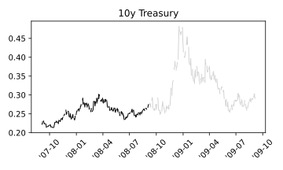

# 2008-09-16

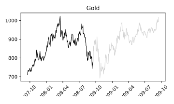

## [Stocks rise on Fed](https://money.cnn.com/2008/09/16/markets/markets_newyork/index.htm)
### Investors breathe a sigh of relief that the central bank's outlook was not more bearish. After the close, AIG plummets.

> Following the reports, AIG issued a statement saying that its life insurance, general insurance and retirement services businesses are operating normally. The insurer reiterated that it continues to look for means of raising capital to address what it says are short-term liquidity issues.

> **Fed holds steady**: The central bank held the fed funds rate, a key overnight bank lending rate, steady and continued to acknowledge the weak economy and uncertain outlook in its statement. Despite the recent plunge in oil prices, the Fed also continued to talk about the uncertain inflation outlook.

> "I think they are trying to show people that the economy is not in greater danger because of what happens to a few firms on Wall Street," said Stephen Stanley, chief economist at RBS Greenwich Capital. 

> Ahead of the meeting, the New York Federal Reserve said it would pump an additional $50 billion into the banking system to keep the liquidity flowing on top of the already scheduled $20 billion. The New York Fed enacts the central bank's market operation.

# 2008-09-18

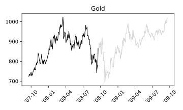

## [Wild rally at the finish](https://money.cnn.com/2008/09/18/markets/markets_newyork/index.htm)
### Dow gains 410 on talk of a long-term government solution to absorbing bad debt.

> NEW YORK (CNNMoney.com) -- Wall Street rallied Thursday, finding momentum at the end of a tough session, on a CNBC report that the government is working on a more permanent solution to absorbing bad debt.

> Volume was particularly heavy ahead of Friday's options expiration, a quarterly event in which stock index futures and options and individual stock futures and options are all expiring simultaneously. This is a process that can lead to big gyrations in the underlying stocks.

> Central banks inject billions: In the aftermath of the Federal Reserve's $85 billion bailout of AIG, central banks around the world agreed Thursday morning to infuse as much as $180 billion into global money markets in a coordinated attempt at taking the edge off nervous markets. That's in addition to the $67 billion that was previously announced.

> "It's still a dangerous environment," said Michael Church, senior portfolio manager at Church Capital. "Despite the liquidity that the central banks have put into the system, banks are still reluctant to lend to each other."

> **Eye on short-sellers**: Stock investors responded positively to an afternoon announcement that Britain's Financial Services Authority (FSA) said it's banning the short-selling of shares in publicly traded financial companies at least through mid-January.

> On Wednesday, the SEC put into place rules to limit so-called "naked" short selling. 

[**Economy**]

> Another report, the Conference Board's index of leading economic indicators (LEI), improved in August to a reading of negative 5 from the previous month's reading of negative 7. Economists expected it to improve more, to a reading of negative 2. 

> Earlier, the Labor Dept. said jobless claims rose to 455,000 last week from 445,000 the previous week. Economists thought the number of Americans filing new claims for unemployment would drop to 440,000.

# 2008-09-19

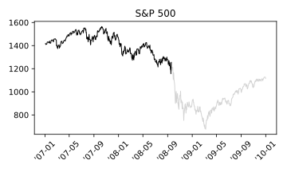

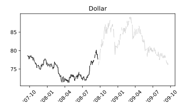

## [Stocks surge as Feds act](https://money.cnn.com/2008/09/19/markets/markets_newyork2/index.htm)
### Wall Street rallies as Washington moves to stem the financial crisis. The Dow jumps 780 points in 2 days - best run since 2000.

> NEW YORK (CNNMoney.com) -- Stocks rallied Friday, with the Dow rising 369 points, as the government's plan to help rescue banks from toxic mortgage debt soothed investors at the end of a gut-churning week on Wall Street.

> Treasury prices plunged and gold prices tumbled as investors bailed out of safe-haven plays and poured money into equities

> "It's a seminal moment in the crisis," Dickson said. "It doesn't mean we're out of the crisis, but the net impact is that people will feel more comfortable investing again."

> **Money markets**: As part of the broad effort to restore stability, the Treasury Department and Fed both announced steps Friday to shore up the nation's money market fund industry, which has stumbled this week amid the financial market crisis. (Full story).

> The Treasury said it will insure up to $50 billion in money-market fund investments at companies that pay a fee to participate in the program. The yearlong initiative guarantees that the funds' value will not fall below the standard $1 a share. 

> At the same time, the Fed will lend an unlimited amount of money to banks to buy asset-backed paper - short-term debt issued by corporations - from money market funds. These holdings have come under pressure as investors cashed in a record $169 billion in money market assets in the past week.

> **Short-selling ban**: And in an attempt to limit the plunge in financial stocks, the Securities and Exchange Commission is temporarily banning the short-selling of nearly 800 financial stocks.

> The ban also probably helped fuel Friday's advance by causing all the short-sellers to jump in and buy shares back.

# 2008-09-29

## [Stocks crushed](https://money.cnn.com/2008/09/29/markets/markets_newyork/index.htm)
### Approximately $1.2 trillion in market value is gone after the House rejects the $700 billion bank bailout plan.

> NEW YORK (CNNMoney.com) -- Stocks skidded Monday, with the Dow slumping nearly 778 points, in the biggest single-day point loss ever, after the House rejected the government's $700 billion bank bailout plan.

> Stocks had fallen from the get-go Monday morning. In addition to expectations for the bailout, there was also news that troubled Wachovia had to sell its banking assets to Citigroup. A number of European banks also collapsed. 

[**Credit markets**]

> The Libor-OIS spread, one gauge that banks use to determine lending rates, rose to a record 2.2%.

> Meanwhile, the TED spread hit a more than 26-year high of 3.58% before dipping back to 3.54%. The TED spread is the difference between what banks charge each other to borrow for three months and what the Treasury pays. When banks charge each other a higher premium than the U.S. government, that's a sign of fear.

> Long-term Treasury prices rose, lowering the yield on the benchmark 10-year note to 3.58% from 3.82% late Friday. Treasury prices and yields move in opposite directions.

> Treasury prices have been rallying recently and yields tumbling as nervous stock market investors have looked for safer areas to move their cash. 

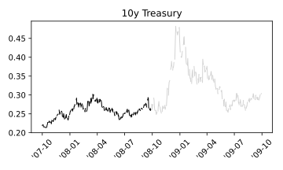

# 2008-09-30

> A closely watched measure of the housing sector showed that home prices in July fell by the largest rate ever, although the pace of monthly declines slowed.

> The Chicago PMI, a key manufacturing report, fell to 56.7 in September from 57.9 in the prior month. However, the decline was smaller than economists were expecting. Any reading over 50 suggests growth.

> The September consumer confidence index topped forecasts, the Conference Board reported. It climbed to 59.8 from a revised 58.5 in August, surprising economists who thought it would fall to 55.

# 2008-10-06

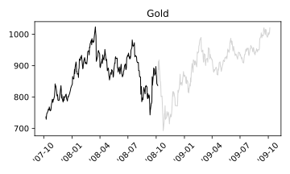

## [Tough day for stocks](https://money.cnn.com/2008/10/06/markets/markets_newyork/index.htm)

### But losses are pared in half after Dow drop reaches 800 points on credit crisis.

> NEW YORK (CNNMoney.com) -- Stocks plunged Monday, with the Dow down as much as 800 points during the session, as the $700 billion bank bailout plan and European government attempts to prop up faltering banks failed to comfort panicky investors.

> Treasurys rallied, lowering the corresponding yields as investors sought safety in government debt. Gold rallied for the same reason. Oil dipped. The dollar jumped versus the euro and fell against the yen.

> Investors across the board are realizing that the $700 billion U.S. bank bailout was not a cure-all, said Dan Genter, president and CEO at RNC Genter Capital Management. The package involves the Treasury buying bad debt directly from banks in order to get them to start lending to each other again

> "Everybody thought that the bailout was a panacea. But it's not, it's a tourniquet that stops the bleeding so the patient doesn't die right away," Genter said.

> "It looks like panic capitulation, but there's no telling how long it will last," Halliburton said. "The concern is that we will roll into a very severe recession or even a depression." 

# 2008-10-09

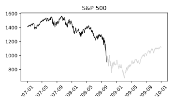
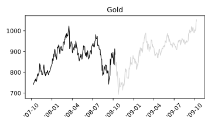
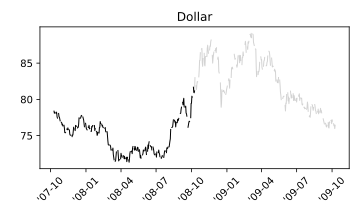
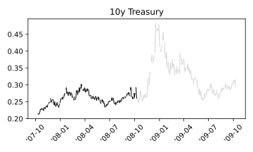

## [Dow tumbles 7%](https://money.cnn.com/2008/10/09/markets/markets_newyork/index.htm)
### Dow falls below 8,600 for first time since 2003 - on the 1-year anniversary of its all-time high.

> NEW YORK (CNNMoney.com) -- Markets tanked Thursday - with the Dow falling nearly 700 points during the session - as panicked investors dumped stocks across the board.

> "We are in a free fall right now and fundamentals have been thrown out the window," said Phil Orlando, chief equity market strategist at Federated Investors. 

> Stocks have tumbled despite a series of efforts on the part of the government to unfreeze the credit markets and get money flowing through the system again. 

> "[Third quarter] earnings will still be poor, [third-quarter] GDP will be a disaster," he said. "Investors are trying to price in the depth of the recession now."

> One year ago today, the S&P 500 hit an all-time high of 1565.15. As of Thursday's close, it was down 41.9%.

> In an effort to get money moving again, the government has taken a number of dramatic steps, including announcing an emergency interest-rate cut Wednesday, coordinated with banks around the world.

# 2008-10-10

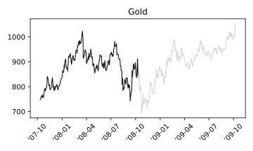

## [Vertigo on Wall Street](https://money.cnn.com/2008/10/10/markets/markets_newyork/index.htm)
### Volatile Dow plunges as much as 697 points, rises as much as 322, as panicky investors try to find their footing.

> NEW YORK� (CNNMoney.com) -- Stocks ended with slim declines Friday, as investors fought back from a decline of as much as 697 points on the Dow amid the global market meltdown.

> Credit markets remained tight, although short-term lending showed some improvement from recent days. Treasury prices fell, raising the corresponding yields. The dollar gained versus the yen and fell against the euro. Oil, gas and gold prices fell.

> On Friday, finance ministers from the Group of Seven (G-7) nations said that exceptional steps are needed to ease the global financial crisis and get money flowing again.

> "The magnitude of what's going on is unprecedented and people are frightened," said Robert Philips, senior portfolio strategist at BLB&B Advisors. 

> "Fear is feeding upon itself and nothing the officials have done to this point seems to stem the tide," said Ryan Atkinson, market analyst at Balestra Capital.

> **Looking for a bottom**: Stocks have been in a bear market for most of the year, but the selling began accelerating in September following a series of bank failures and mergers.

> And investors across the board are pulling money out of equities, with $43.3 billion pulled out of stock mutual funds during the week ended Oct. 8, according to TrimTabs Research.

> "To some extent, we are seeing a retail investor capitulation," said Kelli Hill, portfolio manager at Ashfield Capital Partners. "And when everyone is getting out, that suggests we're getting closer to finding a bottom," she said.

> **Other markets**: Oil prices plunged to a 13-month low Friday on bets that the slowing global economy will drag down oil demand.