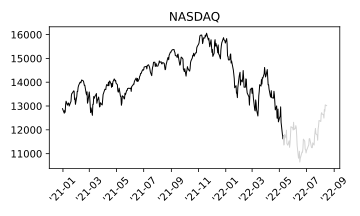
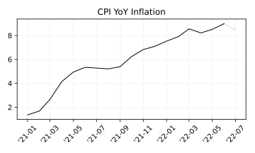
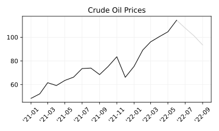

# 2022-05-10

## [Ark Invest's 75% decline in its flagship ETF hasn't stopped investors from pouring $1.3 billion in the fund in 2022](https://markets.businessinsider.com/news/etf/ark-invest-billion-net-inflows-despite-price-decline-cathie-wood-2022-5)

# 2022-06-10

## [The S&P 500 is in a bear market; here’s what that means](https://abcnews.go.com/US/wireStory/us-futures-point-bear-market-heres-means-85356808)

### Wall Street opened the week with heavy losses that put the benchmark S&P 500 at a level considered to be a so-called bear market

> NEW YORK -- Wall Street is back in the claws of a bear market as worries about inflation and higher interest rates overwhelm investors. 

**WHAT’S BOTHERING INVESTORS?**

> Market enemy No. 1 is interest rates, which are rising quickly as a result of the high inflation battering the economy. Low rates act like steroids for stocks and other investments, and Wall Street is now going through withdrawal. 

> Last month, the Fed signaled additional rate increases of double the usual amount are likely in upcoming months. Consumer prices are at the highest level in four decades, and rose 8.6% in May compared with a year ago.

> If customers are paying more to borrow money, they can’t buy as much stuff, so less revenue flows to a company’s bottom line. Stocks tend to track profits over time. Higher rates also make investors less willing to pay elevated prices for stocks, which are riskier than bonds, when bonds are suddenly paying more in interest thanks to the Fed.

> Critics said the overall stock market came into the year looking pricey versus history. Big technology stocks and other winners of the pandemic were seen as the most expensive, and those stocks have been the most punished as rates have risen. But the pain is spreading widely, with retailers signaling a shift in consumer behavior.

# 2022-06-13

## [Stocks’ Pandemic Bull Run Ends With Recession Fear: Markets Wrap](https://www.bloomberg.com/news/articles/2022-06-12/inflation-thunderbolt-primes-stocks-bonds-for-more-volatility#xj4y7vzkg)

> “It’s going to get a little uglier,” said Victoria Greene, chief investment officer at G Squared Private Wealth. “It’s going to be very hard for stocks to rally when the Fed continues to put hawkish pressure. There’s no way they can slam on the brakes with inflation without slamming on the brakes economically speaking. It’s funny we still have recession deniers.”

> Equities still aren’t fully reflecting the risks facing corporate earnings, according to strategists at Morgan Stanley, Goldman Sachs Group Inc. and BlackRock Investment Institute. Weaker consumer demand and aggressive tightening by the Fed in an attempt to fight the hottest US inflation in four decades can do further damage to bottom lines and, in turn, share prices. For Evercore strategist Julian Emanuel, “what’s been missing the last several months is sort of what I would call a ‘cathartic flush out,’ where you get the VIX above 40, which is one of the things you need for at least a trading bottom.”

> The last bulwark in stocks is in danger of shattering, if the mood of chief executive officers is any indication. A survey of sentiment among corporate stewards by the Conference Board showed that CEO confidence declined sharply in the second quarter of the year for the fourth straight time. Similar skepticism in the past has always coincided with a recession in profits, wrote Lisa Shalett, chief investment officer at Morgan Stanley Wealth Management.

> The damage in the highly speculative crypto market took on staggering contours as the value of all assets sank below $1 trillion, down by two-thirds from the heady levels reached in November. Bitcoin and its cousins have largely tracked risk assets, but the latest leg down -- as much as 17% for the world’s largest digital token -- came with concern that the freezing of withdrawals at the Celsius lending platform might indicate systemic risk in the crypto world that could accelerate the meltdown.