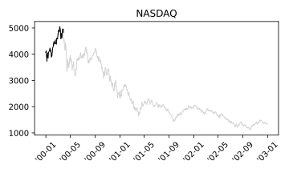
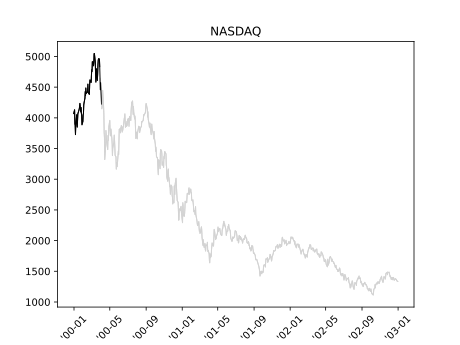
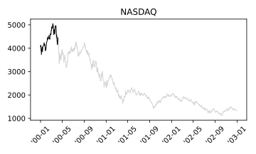
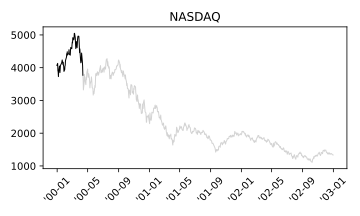
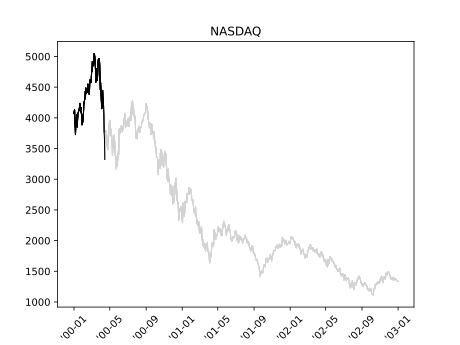
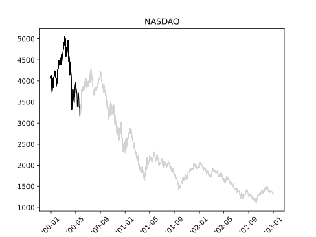
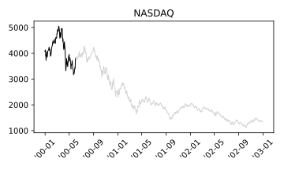
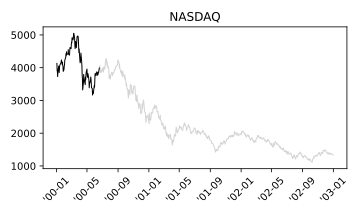
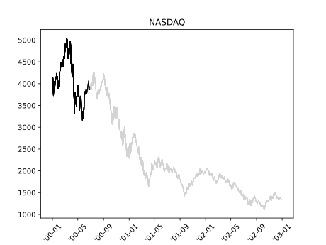

# 2000-03-28

## [Wall St. hit by Cohen](https://money.cnn.com/2000/03/28/markets/markets_newyork/)
### Strategist's portfolio juggling spooks investors as Nasdaq and Dow fall

> NEW YORK (CNNfn) - Investors heeded one of Wall Street's best-known market strategists Tuesday, reducing stock positions after Abby Joseph Cohen advised such a move.

> Cohen, investment strategist at Goldman Sachs, also warned that high-flying technology shares might not have much room left to grow.

> But in a quiet news period after the Federal Reserve's latest interest-rate hike and ahead of first-quarter earnings reporting season, analysts said Cohen's comments met a market looking any reasons to buy or sell.

**Waiting for OPEC**

> Wall Street again watched OPEC Tuesday. After the close of trading, the 11-nation oil cartel once again failed to reach consensus on crude-oil production.

> The standstill comes as oil prices tripled during the last 12 months, a development analysts fear could hurt profits across many industries and spark an outbreak of inflation.

# 2000-04-03

## [Nasdaq sinks 350 points](https://money.cnn.com/2000/04/03/markets/markets_newyork/)
### Hit by Microsoft, tech gauge tumbles nearly 350 points; Dow rises

> NEW YORK (CNNfn) - The Nasdaq composite index plunged nearly 8 percent Monday, suffering its biggest point loss on record, hurt by Microsoft, which tumbled after talks to settle its landmark antitrust case with the government collapsed. 

> "We are seeing a rotation back into some of the real companies, if you will," Robert Armknecht, portfolio manager at FleetBoston Financial, told CNNfn's market coverage.

# 2000-04-07

## [Nasdaq posts record gain](https://money.cnn.com/2000/04/07/markets/markets_newyork/)
### Tech stocks surge lifting Nasdaq and supporting Dow after rough week

> With earnings reporting season picking up steam next week, investors Friday rewarded companies with strong growth prospects.

**Jobs data boost stocks**

> In the week's mostly closely watched economic indicator, the jobs report for March failed to show the kind of strength that makes Wall Street fret about rising inflation.

> While the U.S. economy created 416,000 jobs in March, above forecasts, the figures included one-time anomalies. The government hired 117,000 census takers in the period. And because March was five weeks long, another 50,000 to 100,000 positions were added to the total, the Labor Department said.

> Wall Street focused more closely on news that the unemployment rate did not fall as expected, but held steady at 4.1 percent. Wage inflation, meanwhile, did not rise with any significance, climbing 0.4 percent.

## [Nasdaq plunges on sell-off](https://money.cnn.com/2000/04/10/markets/markets_newyork/)
### Investors lose confidence in tech stocks' value, while the Dow heads north

> Monday's sell-off came after Merrill Lynch chief market analyst Richard McCabe advised clients to reduce exposure to tech stocks and seek opportunities in "old economy" shares such as those found in the Dow.

>  "We think that investors ought to use rebounds to reduce exposure to technology stocks that have declined by 40-to-50 percent or more from their recent highs," McCabe wrote.

> It's not unusual for influential strategists to move markets. Last month, Goldman Sachs strategist Abby Joseph Cohen reduced the technology weighting in her model portfolio, sparking a Nasdaq sell-off.

## [Wall St. pummeled by selling](https://money.cnn.com/2000/04/12/markets/markets_newyork/)
### Investors dump Dow tech stocks late in the day, following Nasdaq's lead

**Techs continue to slide**

>  Technology stocks have come under fire within the past month, as analysts continue suggesting that technology issues may be overvalued.

> "As we sit back and digest these volatile days, one thing definitely comes to mind -- and the word is rotation," wrote Ralph Acampora, director of technical research at Prudential Securities, in a note to clients. "As long as we can see money move from one sector to another, that is constructive. Hence, stock selection is key."

**Financials' performance not enough to lift Dow**

> Despite the heavy tech sell-off on the Dow, financial stocks were the main beneficiaries of the sinking Nasdaq. Still, analysts were calm in the face of the sell-off, saying it reduced some of the speculative froth in the market.

> "We feel that what's going on right now is nothing more than a needed correction," said Christopher Ainsworth, president of Goodworth Holding, told CNN's Street Sweep.

> Mark Klee, manager of the John Hancock Technology Fund, agreed. "I think a lot of these stocks had gotten ahead of themselves," said Klee, who predicted the Nasdaq is near its bottom.

## [Bleak Friday on Wall Street](https://money.cnn.com/2000/04/14/markets/markets_newyork/)
### Unnerved investors rapidly unload stocks amid inflationary fears

> NEW YORK (CNNfn) - U.S. stocks plummeted Friday, capping off five days of stunning losses that handed the Nasdaq composite index its worst weekly performance of all time and the Dow Jones industrial average its steepest one-session point loss in history.

> **Friday's plunge came after the government said prices at the consumer level showed surprising strength last month, triggering fears that the Federal Reserve may raise interest rates more aggressively.**

**Economic data sparks sell-off**

> The Federal Reserve has raised interest rates five times since last June -- each time just a quarter point -- bringing its benchmark Fed funds lending rate to 6 percent.

> In Friday's major economic indicator, consumer prices jumped 0.7 percent in March, or 0.4 percent excluding often-volatile food and energy prices, according to the Commerce Department. The overall rise was the biggest since April 1999 and exceeded Wall Street forecasts.

**Strong earnings not enough to attract buyers**

> Bank stocks, which rallied earlier in the week after some strong earnings reports, were among the biggest losers.

## [Blue chips boost Wall Street](https://money.cnn.com/2000/04/17/markets/markets_newyork/)
### Investors snap up technology bargains, lifting both Nasdaq and the Dow

> NEW YORK (CNNfn) - U.S. stock markets soared Monday in a choppy trading session as investors jumped into the bargain bin to snap up technology stocks, cheapened by last week's hefty sell-off.

**Goldman's Cohen keeps outlook unchanged**

> Investors could gain some respite from analysts' comments that the market remains fundamentally sound. Influential market strategist Abby Joseph Cohen, chairwoman of Goldman Sachs' investment policy committee, told clients Monday that the recent stock volatility has been driven more by market factors rather than a change in fundamentals.

> "We continue to believe that a sharp upward move in inflation is unlikely," she wrote in a research note. 

## [Tech buyers lift Wall St.](https://money.cnn.com/2000/05/01/markets/markets_newyork/)
### Investors regain confidence in tech stocks, boosting Nasdaq and Dow

> NEW YORK (CNNfn) - U.S. stocks rallied as investors jumped into the buying ring Monday afternoon to snap up technology stocks - seen as a resilient sector to guard against aggressive interest rate hikes - with the beleaguered Microsoft Corp. leading the way.

## [Nasdaq sets low for year](https://money.cnn.com/2000/05/23/markets/markets_newyork/)
### Tech sell-off enters day five as interest rate concerns continue unabated

> NEW YORK (CNNfn) - The Nasdaq composite index tumbled to its lowest close of the year Tuesday and wiped out all of its gains since early November, as fears grew that higher interest rates will hurt earnings.

> The losses came exactly one week after the Federal Reserve raised interest rates and warned that even steeper borrowing costs may lie ahead.

**Techs keep falling**

> The Nasdaq's steady losses since March 10, when the gauge hit a record high of 5,048.62, come as interest rates have jumped to their highest levels in nine years. The Federal Reserve last week tightened credit for the sixth time in 11 months, and hinted that more rate hikes lie ahead. Analysts expect difficulty for the market until the number and consequences of those hikes are known.

## [Nasdaq roars higher](https://money.cnn.com/2000/05/30/markets/markets_newyork/)
### Tech buying sends Nasdaq to record gains; Dow powered by Intel

> In spite of the strong rally, analysts said the lack of volume showed there still may be selling in sight. "The momentum players are not back in full swing," said Peter Cardillo, research director at Westfalia Investments.

**Tech stocks lead the buying**

> Chip makers also were attracting buyers after the World Semiconductor Trade Statistics organization said worldwide semiconductor industry sales could grow 30.6 percent in 2000 from $195.06 billion a year ago.

**Eyes focus on economic data**

> Analysts said investors will take notice of all economic data this week with the hope that they will signal some slowing of the surging economy, which could mean interest rate hikes are near an end. The week will be capped by the Labor Department's employment report for May.

## [Bulls trounce Wall Street](https://money.cnn.com/2000/06/02/markets/markets_newyork/)
### Investor optimism rekindled by jobs data; Nasdaq, Dow surge higher

> NEW YORK (CNNfn) - Wall Street celebrated Main Street's misery Friday, after a key labor report showing slower-than-expected job growth sparked a searing rally that sent the Nasdaq composite index to its highest close in a month.

> The May unemployment report, which showed the first decline in hiring by U.S. companies in more than four years, would normally be seen as bad news.

> But in the current surging economy, where investors are nervous that the Federal Reserve will continue to raise interest rates to slow things down, the data prompted investors to snap up stocks at the open and never look back.

> The catalysts were clear. Reports showed that employment, the housing market and leading economic indicators all slowed. Manufacturing and construction spending also ebbed.

**Economic data draws in buyers**

> The Labor Department said unemployment rose to 4.1 percent in May from a 30-year low of 3.9 percent in April, while hourly wages rose only 0.1 percent, well below the 0.4 percent forecast. And there were only 231,000 new jobs created in May, which was well below Wall Street forecasts of 375,000. In fact, the additional jobs all came from government hiring and there was actually a decline in jobs in the private sector.

## [Nasdaq powered by Intel](https://money.cnn.com/2000/06/19/markets/markets_newyork/)
### Surge in chipmaker also lifts Dow despite Honeywell's plunge

> Lehman Brothers raised its earnings forecasts for Intel, sending shares of the world's largest chipmaker and Dow Jones industrial average member up more than 8 percent.

> "We're looking for any excuse to rally," said Finnerty, who linked the gains to the growing belief that the Federal Reserve won't raise the cost of borrowing when it meets next week.

## [Wall St. rises, rates don't](https://money.cnn.com/2000/06/28/markets/markets_newyork/)
### Tech buyers emerge as Fed curbs rate increase; Dow, Nasdaq lifted

> NEW YORK (CNNfn) - Technology stocks were bought in abundance Wednesday as investors took comfort from news that the Federal Reserve left interest rates unchanged for now.

> Also boosting investor confidence was the Fed's surprising comments that it may be nearing the end of its credit tightening cycle.

> "They were less forceful in their rhetoric and that shows a little light at the end of the tunnel," said Art Hogan, chief market analyst at Jefferies & Co. "Clearly they're at a point where what they say is more important than what they do and that's playing itself out in the equity markets."

## [Nasdaq plunges 179 points](https://money.cnn.com/2000/07/28/markets/markets_newyork/)
### Revenue concerns unnerve investors to sell techs; financials hurt the Dow

> NEW YORK (CNNfn) - The Nasdaq composite index capped off one of its worst weeks Friday, plunging more than 170 points, or more than 4 percent, as investors went on a selling spree -- betting that risky technology stocks could not continue to achieve strong revenue. The spree was apparently sparked by a negative outlook from American Power Conversion Corp.

> Friday's economic data renewed concern that the Federal Reserve may not be done raising interest rates, prompting investors to dump rate-sensitive financial issues, sending the Dow Jones industrial average down nearly 1 percent.

> A government report showed gross domestic product for the second quarter growing at an annual rate of 5.2 percent, well above the 3.7 percent analysts anticipated. That accelerated the selling wave on the Dow.

**Investors spooked by revenue warnings**

> Warnings about corporate quarterly results drew attention again Friday, capping a week in which investors severely punished even the slightest downward deviation from expectations.

> American Power Conversion Corp. (APCC: Research, Estimates), a leading maker of power supplies and surge protectors for computers and other electronic gear, slumped 20-11/16 to 25-13/16 after it warned its third-quarter earnings will fall short of expectations.

**Investors wary of economic data**

> The Federal Reserve's monetary policy-making body meets again on August 22 and after six interest rate hikes over the past year, investors are hungry for any indications that the economy is slowing and the Fed is ending its tightening cycle.

> Besides the GDP growth rate, the report released by the Commerce Department showed that a key inflation gauge, the price deflator, rose 2.5 percent, in line with forecasts.

> "The good news is that on the consumer side of things, spending actually declined, and the real good news is the deflator was lower than the last quarter and there was a revision from the first quarter. So when you really dissect it all, it wasn't all that bad," said Peter Cardillo, director of research at Westfalia Investments.

> First-quarter gross domestic product growth was revised down to a 4.8 percent rate from the 5.5 percent initially reported.