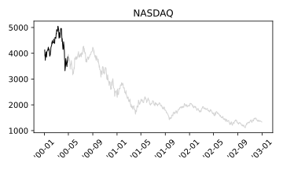
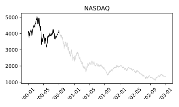
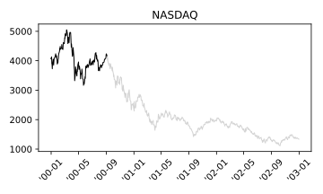
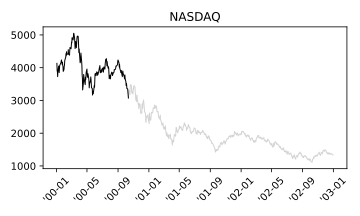

# 2000-03-28

## [Wall St. hit by Cohen](https://money.cnn.com/2000/03/28/markets/markets_newyork/)
### Strategist's portfolio juggling spooks investors as Nasdaq and Dow fall

> NEW YORK (CNNfn) - Investors heeded one of Wall Street's best-known market strategists Tuesday, reducing stock positions after Abby Joseph Cohen advised such a move.

> Cohen, investment strategist at Goldman Sachs, also warned that high-flying technology shares might not have much room left to grow.

> But in a quiet news period after the Federal Reserve's latest interest-rate hike and ahead of first-quarter earnings reporting season, analysts said Cohen's comments met a market looking any reasons to buy or sell.

**Waiting for OPEC**

> Wall Street again watched OPEC Tuesday. After the close of trading, the 11-nation oil cartel once again failed to reach consensus on crude-oil production.

> The standstill comes as oil prices tripled during the last 12 months, a development analysts fear could hurt profits across many industries and spark an outbreak of inflation.

# 2000-04-03

## [Nasdaq sinks 350 points](https://money.cnn.com/2000/04/03/markets/markets_newyork/)
### Hit by Microsoft, tech gauge tumbles nearly 350 points; Dow rises

> NEW YORK (CNNfn) - The Nasdaq composite index plunged nearly 8 percent Monday, suffering its biggest point loss on record, hurt by Microsoft, which tumbled after talks to settle its landmark antitrust case with the government collapsed. 

> "We are seeing a rotation back into some of the real companies, if you will," Robert Armknecht, portfolio manager at FleetBoston Financial, told CNNfn's market coverage.

# 2000-04-07

## [Nasdaq posts record gain](https://money.cnn.com/2000/04/07/markets/markets_newyork/)
### Tech stocks surge lifting Nasdaq and supporting Dow after rough week

> With earnings reporting season picking up steam next week, investors Friday rewarded companies with strong growth prospects.

**Jobs data boost stocks**

> In the week's mostly closely watched economic indicator, the jobs report for March failed to show the kind of strength that makes Wall Street fret about rising inflation.

> While the U.S. economy created 416,000 jobs in March, above forecasts, the figures included one-time anomalies. The government hired 117,000 census takers in the period. And because March was five weeks long, another 50,000 to 100,000 positions were added to the total, the Labor Department said.

> Wall Street focused more closely on news that the unemployment rate did not fall as expected, but held steady at 4.1 percent. Wage inflation, meanwhile, did not rise with any significance, climbing 0.4 percent.

# 2000-04-10

## [Nasdaq plunges on sell-off](https://money.cnn.com/2000/04/10/markets/markets_newyork/)
### Investors lose confidence in tech stocks' value, while the Dow heads north

> Monday's sell-off came after Merrill Lynch chief market analyst Richard McCabe advised clients to reduce exposure to tech stocks and seek opportunities in "old economy" shares such as those found in the Dow.

>  "We think that investors ought to use rebounds to reduce exposure to technology stocks that have declined by 40-to-50 percent or more from their recent highs," McCabe wrote.

> It's not unusual for influential strategists to move markets. Last month, Goldman Sachs strategist Abby Joseph Cohen reduced the technology weighting in her model portfolio, sparking a Nasdaq sell-off.

# 2000-04-12

## [Wall St. pummeled by selling](https://money.cnn.com/2000/04/12/markets/markets_newyork/)
### Investors dump Dow tech stocks late in the day, following Nasdaq's lead

**Techs continue to slide**

>  Technology stocks have come under fire within the past month, as analysts continue suggesting that technology issues may be overvalued.

> "As we sit back and digest these volatile days, one thing definitely comes to mind -- and the word is rotation," wrote Ralph Acampora, director of technical research at Prudential Securities, in a note to clients. "As long as we can see money move from one sector to another, that is constructive. Hence, stock selection is key."

**Financials' performance not enough to lift Dow**

> Despite the heavy tech sell-off on the Dow, financial stocks were the main beneficiaries of the sinking Nasdaq. Still, analysts were calm in the face of the sell-off, saying it reduced some of the speculative froth in the market.

> "We feel that what's going on right now is nothing more than a needed correction," said Christopher Ainsworth, president of Goodworth Holding, told CNN's Street Sweep.

> Mark Klee, manager of the John Hancock Technology Fund, agreed. "I think a lot of these stocks had gotten ahead of themselves," said Klee, who predicted the Nasdaq is near its bottom.

# 2000-04-14

## [Bleak Friday on Wall Street](https://money.cnn.com/2000/04/14/markets/markets_newyork/)
### Unnerved investors rapidly unload stocks amid inflationary fears

> NEW YORK (CNNfn) - U.S. stocks plummeted Friday, capping off five days of stunning losses that handed the Nasdaq composite index its worst weekly performance of all time and the Dow Jones industrial average its steepest one-session point loss in history.

> **Friday's plunge came after the government said prices at the consumer level showed surprising strength last month, triggering fears that the Federal Reserve may raise interest rates more aggressively.**

**Economic data sparks sell-off**

> The Federal Reserve has raised interest rates five times since last June -- each time just a quarter point -- bringing its benchmark Fed funds lending rate to 6 percent.

> In Friday's major economic indicator, consumer prices jumped 0.7 percent in March, or 0.4 percent excluding often-volatile food and energy prices, according to the Commerce Department. The overall rise was the biggest since April 1999 and exceeded Wall Street forecasts.

**Strong earnings not enough to attract buyers**

> Bank stocks, which rallied earlier in the week after some strong earnings reports, were among the biggest losers.

# 2000-04-17

## [Blue chips boost Wall Street](https://money.cnn.com/2000/04/17/markets/markets_newyork/)
### Investors snap up technology bargains, lifting both Nasdaq and the Dow

> NEW YORK (CNNfn) - U.S. stock markets soared Monday in a choppy trading session as investors jumped into the bargain bin to snap up technology stocks, cheapened by last week's hefty sell-off.

**Goldman's Cohen keeps outlook unchanged**

> Investors could gain some respite from analysts' comments that the market remains fundamentally sound. Influential market strategist Abby Joseph Cohen, chairwoman of Goldman Sachs' investment policy committee, told clients Monday that the recent stock volatility has been driven more by market factors rather than a change in fundamentals.

> "We continue to believe that a sharp upward move in inflation is unlikely," she wrote in a research note.

# 2000-04-28

## [Tech buying fuels Nasdaq](https://money.cnn.com/2000/04/28/markets/markets_newyork/)
### Inflationary woes prompt 'old economy' sell-off of the Dow industrials

> NEW YORK (CNNfn) - Attention shifted to inflationary concerns Friday as the week's economic indicators suggested the white-hot economy is not about to burn out, prompting investors to snap up technology shares and dump interest-rate sensitive "old economy" issues.

> "Higher interest rates are an impediment to companies where cost is important and that's old economy stocks," said Barry Hyman, chief market strategist at Ehrenkrantz King Nussbaum Inc. "What we are seeing is a defensive move into technology stocks."

> "I think we're returning to the inflationary worries which is more painful for interest rate-sensitive (companies) and less an issue for technology," said Thomas Galvin, chief investment officer at Donaldson Lufkin & Jenrette. "It's a similar rotation that began yesterday (Thursday). People are concerned about inflation."

**Fickle investors snatch tech stocks**

> Analysts said a shift in sentiment was prompting investors to sell off some of the interest-rate sensitive Dow stocks and seek shelter in technology issues.

> "I think we're returning to the inflationary worries which is more painful for interest rate-sensitive (companies) and less an issue for technology," said Thomas Galvin, chief investment officer at Donaldson Lufkin & Jenrette. "It's a similar rotation that began yesterday (Thursday). People are concerned about inflation."

**Investors wary over interest rate hikes**

> The Federal Open Market Committee will meet May 16, and expectations had been for a quarter-point increase. But recent economic data, particularly Thursday's gross domestic product and employment cost index reports, gave analysts pause to consider that a half-point rate hike may be possible.

> "I think the Fed's trying to get (reaction) with talk and not action," John Dessauer, chairman of McGinn Investment Management, told CNNfn's Market Coverage.

# 2000-05-01

## [Tech buyers lift Wall St.](https://money.cnn.com/2000/05/01/markets/markets_newyork/)
### Investors regain confidence in tech stocks, boosting Nasdaq and Dow

> NEW YORK (CNNfn) - U.S. stocks rallied as investors jumped into the buying ring Monday afternoon to snap up technology stocks - seen as a resilient sector to guard against aggressive interest rate hikes - with the beleaguered Microsoft Corp. leading the way.

# 2000-05-11

## U.S. Stock-Index Futures Rise as Report Shows April Retail Sales Fell (Bloomberg)

> New York, May 11 (Bloomberg) - U.S. stocks gained after a report showed April retail sales dropped from the month before. The report eased some concerns that strong consumer spending could spur inflation and push interest rates higher.

> Intel Corp. and Cisco Systems Inc., the largest companies in the Nasdaq Composite Index, rose. The report showed sales at U.S. retailers fell last month for the first time in a year and a half.

> The unexpected drop in retail sales "gives a sign that the economy is starting to slow a little," said Richard Cripps, chief market strategist at Legg Mason Wood Walker in Baltimore. "The
Fed won't have to be as aggressive."

> The Federal Reserve is expected to raise short-term interest rates by as much as half a point on May 16. "A 50 basis-point rise looks factored into the market now," said Jacques-Antoine Bretteil, who helps manage $700 million at International Capital Gestion in Paris. "If the Fed raises rates more than that the market will really take a blow." Rising interest rates tend to penalize stocks that are most expensive relative to their earnings, he said.

# 2000-05-19

## U.S. Stocks Fall, Led by Intel, GE; Nasdaq Composite Loses 3.9% for Week (Bloomberg)

> New York, May 19 (Bloomberg) -- U.S. stocks fell, led by Intel Corp. and General Electric Co., on expectations the Federal Reserve will keep raising interest rates this year, slowing the economy and reducing corporate revenue and profit growth. 
"Investors have been justifying paying extraordinary prices for tech stocks because of the expectation for continued revenue growth," said Charles Crane, market strategist at Spears, Benzak, Salomon & Farrell Inc., which manages $5 billion. "Any threat to that growth" puts technology shares in trouble.

> The Nasdaq fell three straight days, with technology shares leading the losses, after the Federal Reserve said Tuesday it will raise interest rates to hold inflation in check, even as it boosted rates for the sixth time since June. 
"Tech companies themselves aren't heavy borrowers, but their customers are going to be hurt by higher interest rates" and reduce spending on technology, said Crane.

> Cisco fell 1 15/16 to 53 7/16 and was the most active stock, as it has been every day this week. The No. 1 computer-networking equipment maker, which rose 50 percent in the first three months of the year, has wiped out all of that gain and is now the third most valuable company in the S&P; 500 behind General Electric Co. and Intel.
**"I sold the last of my Cisco yesterday," said Johan Vystavel, a fund manager at HWB Capital Management, in Surrey, England. "I got out above purchase price. It's a good company, but at 100 times earnings it's just too expensive."** The shares trade for 103 times profit.

> U.S. commercial banks themselves are taking a more conservative stance in extending credit to businesses by tightening loan standards, the Fed said. A survey of loan officers also indicated demand for home mortgages had cooled from three months ago.

> The decline in the euro to a record low of 88.52 U.S. cents may also be hurting shares of companies that sell goods and services to Europe, traders said. The euro rallied to 89.92 U.S.
cents in recent trading. "It's a negative influence on the stock market," said Arthur Cashin, PaineWebber Inc.'s director of floor operations at the NYSE. "U.S. goods will be more expensive in Europe."

> Cisco reported a quarter of its sales were made in Europe last year while Lucent Technologies made 31 percent of its sales in 2000 outside the U.S., according to Bloomberg analytics.

> Eastman Kodak Co., Procter & Gamble Co. and DuPont Co. have all attributed declines in revenue this year to a sagging euro.

> **Though the Nasdaq has lost a third of its value since its March 10 record, individual investors haven't lost their appetite for stock mutual funds, according to research firm TrimTabs.com. 
An estimated $13.1 billion flowed into U.S. stock funds in the week ended Wednesday, up from $5.2 billion the previous week, TrimTabs said.**

# 2000-05-23

## [Nasdaq sets low for year](https://money.cnn.com/2000/05/23/markets/markets_newyork/)
### Tech sell-off enters day five as interest rate concerns continue unabated

> NEW YORK (CNNfn) - The Nasdaq composite index tumbled to its lowest close of the year Tuesday and wiped out all of its gains since early November, as fears grew that higher interest rates will hurt earnings.

> The losses came exactly one week after the Federal Reserve raised interest rates and warned that even steeper borrowing costs may lie ahead.

**Techs keep falling**

> The Nasdaq's steady losses since March 10, when the gauge hit a record high of 5,048.62, come as interest rates have jumped to their highest levels in nine years. The Federal Reserve last week tightened credit for the sixth time in 11 months, and hinted that more rate hikes lie ahead. Analysts expect difficulty for the market until the number and consequences of those hikes are known.

# 2000-05-30

## [Nasdaq roars higher](https://money.cnn.com/2000/05/30/markets/markets_newyork/)
### Tech buying sends Nasdaq to record gains; Dow powered by Intel

> In spite of the strong rally, analysts said the lack of volume showed there still may be selling in sight. "The momentum players are not back in full swing," said Peter Cardillo, research director at Westfalia Investments.

**Tech stocks lead the buying**

> Chip makers also were attracting buyers after the World Semiconductor Trade Statistics organization said worldwide semiconductor industry sales could grow 30.6 percent in 2000 from $195.06 billion a year ago.

**Eyes focus on economic data**

> Analysts said investors will take notice of all economic data this week with the hope that they will signal some slowing of the surging economy, which could mean interest rate hikes are near an end. The week will be capped by the Labor Department's employment report for May.

# 2000-06-01

## [Buyers move into techs amid signs of economic slowing; Nasdaq, Dow rally](https://money.cnn.com/2000/06/01/markets/markets_newyork/)

### Buyers move into techs amid signs of economic slowing; Nasdaq, Dow rally

> Investors looking for some sign that the red-hot economy could be slowing its pace were rewarded Thursday, after economic data raised hopes that interest rate hikes may be near an end, making it safe to start buying stocks.

> Reports indicating a slowdown in manufacturing activity and construction spending hinted that the six Federal Reserve rate hikes since last June may be starting to work.

> "We are not seeing the big slowdown but we are seeing some weakness around the edges showing the medicine is starting to take effect," said Edward Jones' Skrainka. "And I don't think it's just psychological."

> But Ned Riley, chief investment strategist at State Street Global Advisors in Boston, remained cautious, telling CNN's In the Money that slowing the economy may not be enough for the Fed -- slowing the resilient stock market may be important, too.

> Analysts said the technology sector led the parade of buyers with revived confidence that an economic slowdown is on the horizon and now is a good time to buy.

# 2000-06-02

## [Bulls trounce Wall Street](https://money.cnn.com/2000/06/02/markets/markets_newyork/)
### Investor optimism rekindled by jobs data; Nasdaq, Dow surge higher

> NEW YORK (CNNfn) - Wall Street celebrated Main Street's misery Friday, after a key labor report showing slower-than-expected job growth sparked a searing rally that sent the Nasdaq composite index to its highest close in a month.

> The May unemployment report, which showed the first decline in hiring by U.S. companies in more than four years, would normally be seen as bad news.

> But in the current surging economy, where investors are nervous that the Federal Reserve will continue to raise interest rates to slow things down, the data prompted investors to snap up stocks at the open and never look back.

> The catalysts were clear. Reports showed that employment, the housing market and leading economic indicators all slowed. Manufacturing and construction spending also ebbed.

**Economic data draws in buyers**

> The Labor Department said unemployment rose to 4.1 percent in May from a 30-year low of 3.9 percent in April, while hourly wages rose only 0.1 percent, well below the 0.4 percent forecast. And there were only 231,000 new jobs created in May, which was well below Wall Street forecasts of 375,000. In fact, the additional jobs all came from government hiring and there was actually a decline in jobs in the private sector.

# 2000-06-19

## [Nasdaq powered by Intel](https://money.cnn.com/2000/06/19/markets/markets_newyork/)
### Surge in chipmaker also lifts Dow despite Honeywell's plunge

> Lehman Brothers raised its earnings forecasts for Intel, sending shares of the world's largest chipmaker and Dow Jones industrial average member up more than 8 percent.

> "We're looking for any excuse to rally," said Finnerty, who linked the gains to the growing belief that the Federal Reserve won't raise the cost of borrowing when it meets next week.

# 2000-06-28

## [Wall St. rises, rates don't](https://money.cnn.com/2000/06/28/markets/markets_newyork/)
### Tech buyers emerge as Fed curbs rate increase; Dow, Nasdaq lifted

> NEW YORK (CNNfn) - Technology stocks were bought in abundance Wednesday as investors took comfort from news that the Federal Reserve left interest rates unchanged for now.

> Also boosting investor confidence was the Fed's surprising comments that it may be nearing the end of its credit tightening cycle.

> "They were less forceful in their rhetoric and that shows a little light at the end of the tunnel," said Art Hogan, chief market analyst at Jefferies & Co. "Clearly they're at a point where what they say is more important than what they do and that's playing itself out in the equity markets."

# 2000-07-28

## [Nasdaq plunges 179 points](https://money.cnn.com/2000/07/28/markets/markets_newyork/)
### Revenue concerns unnerve investors to sell techs; financials hurt the Dow

> NEW YORK (CNNfn) - The Nasdaq composite index capped off one of its worst weeks Friday, plunging more than 170 points, or more than 4 percent, as investors went on a selling spree -- betting that risky technology stocks could not continue to achieve strong revenue. The spree was apparently sparked by a negative outlook from American Power Conversion Corp.

> Friday's economic data renewed concern that the Federal Reserve may not be done raising interest rates, prompting investors to dump rate-sensitive financial issues, sending the Dow Jones industrial average down nearly 1 percent.

> A government report showed gross domestic product for the second quarter growing at an annual rate of 5.2 percent, well above the 3.7 percent analysts anticipated. That accelerated the selling wave on the Dow.

**Investors spooked by revenue warnings**

> Warnings about corporate quarterly results drew attention again Friday, capping a week in which investors severely punished even the slightest downward deviation from expectations.

> American Power Conversion Corp. (APCC: Research, Estimates), a leading maker of power supplies and surge protectors for computers and other electronic gear, slumped 20-11/16 to 25-13/16 after it warned its third-quarter earnings will fall short of expectations.

**Investors wary of economic data**

> The Federal Reserve's monetary policy-making body meets again on August 22 and after six interest rate hikes over the past year, investors are hungry for any indications that the economy is slowing and the Fed is ending its tightening cycle.

> Besides the GDP growth rate, the report released by the Commerce Department showed that a key inflation gauge, the price deflator, rose 2.5 percent, in line with forecasts.

> "The good news is that on the consumer side of things, spending actually declined, and the real good news is the deflator was lower than the last quarter and there was a revision from the first quarter. So when you really dissect it all, it wasn't all that bad," said Peter Cardillo, director of research at Westfalia Investments.

> First-quarter gross domestic product growth was revised down to a 4.8 percent rate from the 5.5 percent initially reported.

# 2000-08-03

## [Nasdaq rises from sickbed](https://money.cnn.com/2000/08/03/markets/markets_newyork/)
### Tech investors who sold shares in the morning buy in the afternoon

> NEW YORK (CNNfn) - Technology stocks staged a dramatic comeback Thursday, with the Nasdaq composite surging nearly 240 points above its session low as bargain-hunting investors poured back into computer networking and software stocks.

> The gains, which spread to other major indexes, came hours ahead of Friday's report on the job market in July. The closely-watched data could offer clues into whether the Federal Reserve raises interest rates this month.

**Techs rise from the dead**

> Despite these gains, S.G. Cowen's Sheinberg said the focus remains negative.

> "All the news that seems to be coming out is companies telling you that things going forward aren't that great," he said.

**Jobs on horizon**

> The day's activity comes less than 24 hours ahead of the week's most closely watched economic indicator. Analysts Friday will be parsing the government's July employment report for clues about whether the Fed will raise borrowing costs later this month.

> Evidence of an unexpectedly tight labor market, while good for Main Street, would make policy makers fret that employers will bid up wages, sparking an outbreak of inflation that could derail an economic expansion now in its record ninth year. But a slowdown in the job market might convince Fed officials that six credit tightenings since June, 1999, are beginning to bite.

# 2000-08-31

## [Wall St. sizzles in August](https://money.cnn.com/2000/08/31/markets/markets_newyork/)
### Dow, Nasdaq rise as money chases recent winners ahead of jobs data

> NEW YORK (CNNfn) - U.S. stocks soared Thursday, capping off a strong August on Wall Street as investors snapped up many of the month's best-performing shares.

> Many analysts linked the gains, which faded somewhat by day's end, more to forward momentum than any new developments in the state of the economy or the outlook for earnings.

> Still, Ralph Acampora, chief technical analyst at Prudential Securities predicts that after a tough first half, the rest of 2000 will be a good one for stocks now that the Federal Reserve appears done raising interest rates.

**Data shows weakness**

> **In one sign of that slowing, factory orders fell 7.5 percent in July, the largest drop on record, according to a report by the Commerce Department. Analysts surveyed by Briefing.com forecast factory orders would fall just 6.1 percent.**

> Separately, the Chicago Purchasing Management Index (PMI) that measures manufacturing fell to 46.5 in August from 52 in July. The prices paid component -- a measure of inflation -- fell to 58.6 in August from 70 in July.

PMI numbers during 2000-2001:

# 2000-09-05

## [Nasdaq tumbles 2 percent](https://money.cnn.com/2000/09/05/markets/markets_newyork/)
### Intel, WorldCom fall, leading tech index lower while retailers show strength

> NEW YORK (CNNfn) - The Nasdaq composite index fell for the first time in six sessions Tuesday as investors returning from a long holiday weekend shed many of last month's best-performing technology stocks.

> "A little pullback is not surprising given how strong a rally we've had," Tony Cecin, director of U.S. equity trading at U.S. Bancorp Piper Jaffray, said referring to the Nasdaq's 11 percent-plus surge in August.

> The Federal Reserve, which left interest rates unchanged last month, is widely expected to hold borrowing costs steady in the months ahead. And companies don't report financial results for the July-September period until later next month.

**Techs falter**

> While some analysts linked the day's losses to profit taking, Michael Holland, chairman of Holland & Co., said something more fundamental could explain the declines. With the Federal Reserve hiking interest rate six times since June, 1999, Holland sees the losses reflecting concerns that the central bank may have gone too far.

> ""I think it's a harbinger of things to come," Holland told CNN's Street Sweep. "The outcome of what (the Fed has done) is still unknown."

# 2000-09-11

## [Nasdaq plunges; Dow off](https://money.cnn.com/2000/09/11/markets/markets_newyork/)
### Tech stocks continue sell-off on earnings fears; oil keeps rising

> NEW YORK (CNNfn) - The Nasdaq composite index tumbled more than 2 percent Monday, falling to its lowest level in nearly a month as investors wary of slowing corporate profit growth unloaded high-priced technology stocks.

> Analysts explaining the losses cited a combination of selling momentum from last week coupled with fear that technology stock prices still don't reflect forecasts for a cooling economy. A fresh surge in oil prices, meanwhile, reminded Wall Street that business and consumers will pay more for heating and transportation costs in the months ahead, effectively enacting a tax on the economy.

**A September to forget?**

> September is historically a tough time for U.S. markets and this month is looking no different, with the Nasdaq falling four of the last six sessions.

> After a strong August, last week was Wall Street's first losing week since July. It occurred after a series of companies warned that corporate earnings would not meet expectations.

# 2000-09-29

## [Wall St: A month to forget](https://money.cnn.com/2000/09/29/markets/markets_newyork/)
### Tech stocks continue sell-off on earnings fears; oil keeps rising

> NEW YORK (CNNfn) - The latest high-profile profit warning sent U.S. stocks tumbling Friday, capping a month of declines for the major indexes, which have all lost value during a year that's shaping up to be the worst in a decade.

> Wall Street couldn't close the third quarter without one more major earnings blowup. It came from Apple Computer, which said it won't meet quarterly profit targets.

> Stocks did what they typically do in September: fall.

> The negative news comes amid some of the highest oil prices in a decade, raising costs for business and consumers. The euro, meanwhile, has plunged against the dollar, cutting into earnings of multinational companies doing business overseas.

# 2000-10-12

## [Dow plunges more than 3%](https://money.cnn.com/2000/10/12/markets/markets_newyork/)
### A spike in oil prices sends investors fleeing blue chips; Nasdaq falters

> NEW YORK (CNNfn) - The Dow Jones industrial average tumbled nearly 400 points Thursday, its sixth loss in as many sessions and its fifth-biggest point drop on record, after a surge in oil prices sparked fears that rising inflation could harm the economy. 

> Violence escalated in the Mideast, sending oil prices as high as $36 a barrel, in the latest blow to a market that has sold off steadily since Labor Day.

> Thursday's surge in oil prices to nearly 10-year highs, if it holds, could stall consumer spending and eat into corporate profitability. The gains come amid a market worried about slower earnings growth.

> Still, the market showed isolated areas of strength. Chip stocks rose after two semiconductor makers posted strong earnings. Oil shares gained with the price of the commodity. And drug stocks, among the year's best-performing sectors, continued drawing buyers.

**Oil gushes higher**

> The surge in the commodity hit a market already obsessed with how much the slowing economy will bite into profitability. Economists explaining the economy's 10-year expansion often cite the importance of cheap oil, which kept costs down and reduced inflation. Rising crude prices could threaten this growth rate.

**The rally must wait**

> Two key reads on the economy come Friday when the government reports on September retail sales and producer prices. Analysts surveyed by Briefing.com see retail sales gaining 0.4 percent in the month, twice August's 0.2 percent gain. And the producer price index is forecast to have risen 0.4 percent in September, after falling 0.2 percent the previous month.